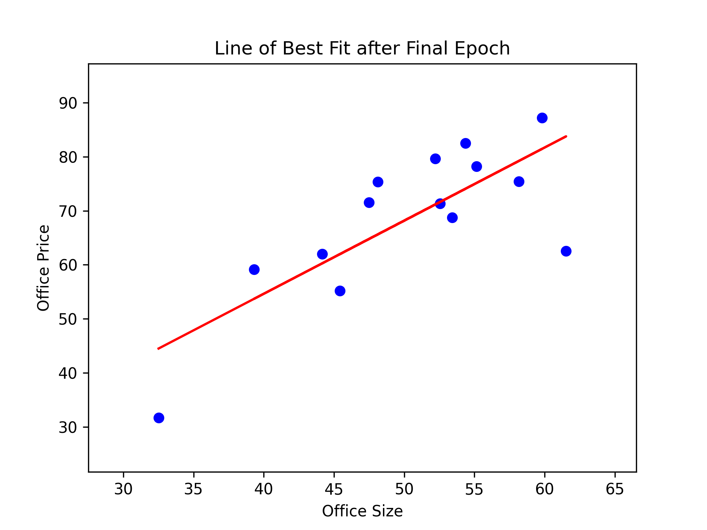

# Linear Regression for Nairobi Office Prices

This project demonstrates a simple implementation of Linear Regression using Gradient Descent to predict office prices based on their sizes. The code is written in Python and utilizes libraries such as NumPy, Pandas, and Matplotlib.

## Dataset
The dataset used is `Nairobi Office Price Ex.csv`, which contains two columns:
- `SIZE`: The size of the office in square feet.
- `PRICE`: The price of the office.

## Code Explanation

### Loading the Dataset
The dataset is loaded using Pandas:
```python
data = pd.read_csv('Nairobi Office Price Ex.csv')
size = data['SIZE'].values
price = data['PRICE'].values
```

### Mean Squared Error (MSE)
A function to compute the Mean Squared Error between the true and predicted values:
```python
def mean_squared_error(y_true, y_pred):
    return np.mean((y_true - y_pred) ** 2)
```

### Gradient Descent
A function to perform a single step of gradient descent to update the slope (`m`) and intercept (`c`):
```python
def gradient_descent(x, y, m, c, learning_rate):
    N = len(x)
    y_pred = m * x + c
    dm = (-2 / N) * np.sum(x * (y - y_pred))
    dc = (-2 / N) * np.sum(y - y_pred)
    m = m - learning_rate * dm
    c = c - learning_rate * dc
    return m, c
```

### Linear Regression Training
The main function to train the linear regression model using gradient descent over a specified number of epochs:
```python
def linear_regression(x, y, epochs=50, learning_rate=0.0001):
    m, c = np.random.rand(), np.random.rand()
    for epoch in range(epochs):
        y_pred = m * x + c
        mse = mean_squared_error(y, y_pred)
        print(f"Epoch {epoch + 1}, MSE: {mse}")
        m, c = gradient_descent(x, y, m, c, learning_rate)
    plt.scatter(x, y, color='blue')
    plt.plot(x, m * x + c, color='red')
    plt.xlabel('Office Size')
    plt.ylabel('Office Price')
    plt.title('Line of Best Fit after Final Epoch')
    plt.savefig('final_fit.png', dpi=300)
    return m, c
```

### Prediction
After training, the model can be used to predict the price of an office given its size:
```python
size_to_predict = 100
predicted_price = m * size_to_predict + c
print(f"Predicted price for office size {size_to_predict} sq. ft: {predicted_price:.2f}")
```

## Line of Best Fit

The following image shows the line of best fit after training the linear regression model:



## Conclusion
This project provides a basic implementation of linear regression using gradient descent to predict office prices based on their sizes. The final model can be visualized with a plot showing the line of best fit.